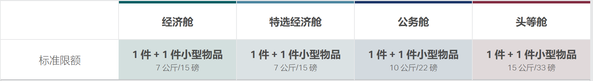
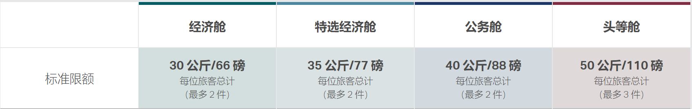

# 2021年英国秋季留学时间安排

### 1. 2021年9月20号返校 存在10天隔离期

| [2021.9.2出发 价格￥7436](https://www.google.com/travel/flights/booking?tfs=CBwQAhqGAWoMCAISCC9tLzBsM2N5EgoyMDIxLTA5LTAycgcIARIDTEhSIiAKA1dVSBIKMjAyMS0wOS0wMhoDWE1OKgJDWjIENjkzOSIfCgNYTU4SCjIwMjEtMDktMDIaA0hLRyoCQ1gyAzk3OSIeCgNIS0cSCjIwMjEtMDktMDMaA0xIUioCQkEyAjMycAGCAQsI____________AUABSAGYAQJggH0&tfu=CnxDalJJY0U5c1ZFVlpWbVJpZWpCQlJGQXRXR2RDUnkwdExTMHRMUzB0TFMxMGFIRnVOa0ZCUVVGQlIwUnZTa0pyUTBaVU5VRkJFaEZEV2pZNU16bDhRMWc1TnpsOFFrRXpNaG9LQ0l3NkVBQWFBME5PV1RnY2NPZi9CZz09EgYIARAAGAA&hl=zh-CN&gl=hk&curr=CNY) | [2021.9.6出发 价格￥11739](https://www.google.com/travel/flights/booking?tfs=CBwQAhpmagwIAhIIL20vMGwzY3kSCjIwMjEtMDktMDZyBwgBEgNMSFIiIAoDV1VIEgoyMDIxLTA5LTA2GgNQVkcqAkNaMgQzNTQzIh8KA1BWRxIKMjAyMS0wOS0wNxoDTEhSKgJCQTIDMTY4cAGCAQsI____________AUABSAGYAQJggH0&tfu=CnRDalJJUTFKb05uRlBUVVkyZDNOQlJFMWlNRUZDUnkwdExTMHRMUzB0TFhSb2NIZ3hPVUZCUVVGQlIwUnZTVGRSVERONVJFRkJFZ3hEV2pNMU5ETjhRa0V4TmpnYUNnamJXeEFBR2dORFRsazRISENYaGdzPRIGCAEQABgA&hl=zh-CN&gl=hk&curr=CNY) |
|:---------------------------------------------------------------------------------------------------------------------------------------------------------------------------------------------------------------------------------------------------------------------------------------------------------------------------------------------------------------------------------------------------------------------------------------------------------------------------------------------------------------------------|:---------------------------------------------------------------------------------------------------------------------------------------------------------------------------------------------------------------------------------------------------------------------------------------------------------------------------------------------------------------------------------------------------------------------------------------------------------------------|
| 南航经济舱Boeing 737CZ 6939 9月2号周四 下午2:45 武汉天河国际机场 (WUH) 行程时间：1 小时 40 分钟 9月2号周四 下午4:25厦门市高崎国际机场 (XMN)                                                                                                                                                                                                                                                                                                                                                                                       | 南航经济舱Boeing 737CZ 3543 9月6号周一 下午6:20 武汉天河国际机场 (WUH) 行程时间：1 小时 35 分钟 9月6号周一 下午7:55上海浦东国际机场 (PVG)                                                                                                                                                                                                                                                                                                                                   |
| 转机用时：4 小时厦门市 (XMN)                                                                                                                                                                                                                                                                                                                                                                                                                                                                                                   | 转机用时：15 小时 5 分钟上海市 (PVG)过夜转机                                                                                                                                                                                                                                                                                                                                                                                                                               |
| 国泰航空经济舱Airbus A330CX 979 9月2号周四 下午8:25 厦门市高崎国际机场 (XMN) 行程时间：1 小时 35 分钟 9月2号周四 下午10:00 香港国际机场 (HKG)                                                                                                                                                                                                                                                                                                                                                                                     | 英航经济舱Boeing 777BA 168 9月7号周二 上午11:00 上海浦东国际机场 (PVG)  行程时间：12 小时 25 分钟 9月7号周二 下午4:25希思罗机场 (LHR)                                                                                                                                                                                                                                                                                                                                      |
| 转机用时：25 小时 10 分钟香港 (HKG) 过夜转机                                                                                                                                                                                                                                                                                                                                                                                                                                                                                     |                                                                                                                                                                                                                                                                                                                                                                                                                                                                      |
| 英航经济舱Boeing 777BA 32 9月3号周五 下午11:10 香港国际机场 (HKG) 行程时间：12 小时 40 分钟行程 含夜间时间 9月4号周六 上午4:50 希思罗机场 (LHR)                                                                                                                                                                                                                                                                                                                                                                                    |                                                                                                                                                                                                                                                                                                                                                                                                                                                                      |

### 2. 9月20号返校 不存在10天隔离期 / 10月1号返校 存在10天隔离期

| [2021.9.17出发 价格￥8026](https://www.google.com/travel/flights/booking?tfs=CBwQAhqGAWoMCAISCC9tLzBsM2N5EgoyMDIxLTA5LTE3cgcIARIDTEhSIiAKA1dVSBIKMjAyMS0wOS0xNxoDWE1OKgJNVTIEMjQzNyIfCgNYTU4SCjIwMjEtMDktMTcaA0hLRyoCQ1gyAzk3OSIeCgNIS0cSCjIwMjEtMDktMTcaA0xIUioCQkEyAjMycAGCAQsI____________AUABSAGYAQJggH0&tfu=CnxDalJJTTBKMlR6UnhTek5UU1VGQlJFdGpkMUZDUnkwdExTMHRMUzB0TFhSb2Ftd3hNVUZCUVVGQlIwUnZTa1Z6UzB0aVJFRkJFaEZOVlRJME16ZDhRMWc1TnpsOFFrRXpNaG9LQ05vK0VBQWFBME5PV1RnY2NQSEdCdz09EgYIARAAGAA&hl=zh-CN&gl=hk&curr=CNY) | [2021.9.17出发 价格￥11739](https://www.google.com/travel/flights/booking?tfs=CBwQAhpmagwIAhIIL20vMGwzY3kSCjIwMjEtMDktMTdyBwgBEgNMSFIiIAoDV1VIEgoyMDIxLTA5LTE3GgNQVkcqAkNaMgQzNTQzIh8KA1BWRxIKMjAyMS0wOS0xOBoDTEhSKgJCQTIDMTY4cAGCAQsI____________AUABSAGYAQJggH0&tfu=CnRDalJJZVV0MGFqaHpaazUyV2xWQlJFZDFNV2RDUnkwdExTMHRMUzB0TFhSb2FHb3lNRUZCUVVGQlIwUnZTa2RGUldWcUxVRkJFZ3hEV2pNMU5ETjhRa0V4TmpnYUNnamJXeEFBR2dORFRsazRISENYaGdzPRIGCAEQABgA&hl=zh-CN&gl=hk&curr=CNY) |
|:----------------------------------------------------------------------------------------------------------------------------------------------------------------------------------------------------------------------------------------------------------------------------------------------------------------------------------------------------------------------------------------------------------------------------------------------------------------------------------------------------------------------------|:----------------------------------------------------------------------------------------------------------------------------------------------------------------------------------------------------------------------------------------------------------------------------------------------------------------------------------------------------------------------------------------------------------------------------------------------------------------------|
| 东航经济舱Boeing 737MU 2437 9月17号周五 下午4:35 武汉天河国际机场 (WUH) 行程时间：1 小时 50 分钟 9月17号周五 下午6:25 厦门市高崎国际机场 (XMN)                                                                                                                                                                                                                                                                                                                                                                                     | 南航经济舱Boeing 737CZ 3543 9月17号周五 下午6:20 武汉天河国际机场 (WUH) 行程时间：1 小时 35 分钟 9月17号周五 下午7:55 上海浦东国际机场 (PVG)                                                                                                                                                                                                                                                                                                                                 |
| 转机用时：2 小时厦门市 (XMN)                                                                                                                                                                                                                                                                                                                                                                                                                                                                                                    | 转机用时：15 小时 5 分钟上海市 (PVG)过夜转机                                                                                                                                                                                                                                                                                                                                                                                                                                |
| 国泰航空经济舱Airbus A330CX 979 9月17号周五 下午8:25 厦门市高崎国际机场 (XMN) 行程时间：1 小时 35 分钟 9月17号周五 下午10:00 香港国际机场 (HKG)                                                                                                                                                                                                                                                                                                                                                                                    | 英航经济舱Boeing 777BA 168 9月18号周六 上午11:00 上海浦东国际机场 (PVG) 行程时间：12 小时 25 分钟 9月18号周六 下午4:25 希思罗机场 (LHR)                                                                                                                                                                                                                                                                                                                                     |
| 转机用时：1 小时 10 分钟香港 (HKG)                                                                                                                                                                                                                                                                                                                                                                                                                                                                                              |                                                                                                                                                                                                                                                                                                                                                                                                                                                                       |
| 英航经济舱Boeing 777BA 32 9月17号周五 下午11:10 香港国际机场 (HKG) 行程时间：12 小时 40 分钟行程含夜间时间 9月18号周六 上午4:50 希思罗机场 (LHR)                                                                                                                                                                                                                                                                                                                                                                                    |                                                                                                                                                                                                                                                                                                                                                                                                                                                                       |

### 3. 10月1号返校 不存在10天隔离期

| [2021.9.27出发 价格￥6446](https://www.google.com/travel/flights/booking?tfs=CBwQAhqGAWoMCAISCC9tLzBsM2N5EgoyMDIxLTA5LTI3cgcIARIDTEhSIiAKA1dVSBIKMjAyMS0wOS0yNxoDWE1OKgJNVTIEMjQzNyIfCgNYTU4SCjIwMjEtMDktMjcaA0hLRyoCQ1gyAzk3OSIeCgNIS0cSCjIwMjEtMDktMjcaA0xIUioCQkEyAjMycAGCAQsI____________AUABSAGYAQJggH0&tfu=CnxDalJJZVV0MGFqaHpaazUyV2xWQlJFY3pVMEZDUnkwdExTMHRMUzB0TFhSb2FHb3lNRUZCUVVGQlIwUnZTa2xCUjBjeU1FRkJFaEZOVlRJME16ZDhRMWc1TnpsOFFrRXpNaG9LQ0s0eUVBQWFBME5PV1RnY2NNV0lCZz09EgYIARAAGAA&hl=zh-CN&gl=hk&curr=CNY) | [2021.9.27出发 价格￥11739](https://www.google.com/travel/flights/booking?tfs=CBwQAhpmagwIAhIIL20vMGwzY3kSCjIwMjEtMDktMjdyBwgBEgNMSFIiIAoDV1VIEgoyMDIxLTA5LTI3GgNQVkcqAkNaMgQzNTQzIh8KA1BWRxIKMjAyMS0wOS0yOBoDTEhSKgJCQTIDMTY4cAGCAQsI____________AUABSAGYAQJggH0&tfu=CnRDalJJYUd0UWEwOHhNR1F3WDNOQlJFMUxVRUZDUnkwdExTMHRMUzB0TFhSb1pYUXhNVUZCUVVGQlIwUnZTa3hqUkdWWWRrRkJFZ3hEV2pNMU5ETjhRa0V4TmpnYUNnamJXeEFBR2dORFRsazRISENYaGdzPRIGCAEQABgA&hl=zh-CN&gl=hk&curr=CNY) |
|:----------------------------------------------------------------------------------------------------------------------------------------------------------------------------------------------------------------------------------------------------------------------------------------------------------------------------------------------------------------------------------------------------------------------------------------------------------------------------------------------------------------------------|:----------------------------------------------------------------------------------------------------------------------------------------------------------------------------------------------------------------------------------------------------------------------------------------------------------------------------------------------------------------------------------------------------------------------------------------------------------------------|
| 东航经济舱Boeing 737MU 2437 9月27号周一 下午4:35 武汉天河国际机场 (WUH) 行程时间：1 小时 50 分钟 9月27号周一 下午6:25 厦门市高崎国际机场 (XMN)                                                                                                                                                                                                                                                                                                                                                                                     | 南航经济舱Boeing 737CZ 3543 9月27号周一 下午6:20 武汉天河国际机场 (WUH) 行程时间：1 小时 35 分钟 9月27号周一 下午7:55 上海浦东国际机场 (PVG)                                                                                                                                                                                                                                                                                                                                 |
| 转机用时：2 小时厦门市 (XMN)                                                                                                                                                                                                                                                                                                                                                                                                                                                                                                    | 转机用时：15 小时 5 分钟上海市 (PVG)过夜转机                                                                                                                                                                                                                                                                                                                                                                                                                                |
| 国泰航空经济舱Airbus A330CX 979 9月27号周一 下午8:25 厦门市高崎国际机场 (XMN) 行程时间：1 小时 35 分钟 9月27号周一 下午10:00 香港国际机场 (HKG)                                                                                                                                                                                                                                                                                                                                                                                    | 英航经济舱Boeing 777BA 168 9月28号周二 上午11:00 上海浦东国际机场 (PVG) 行程时间：12 小时 25 分钟 9月28号周二 下午4:25 希思罗机场 (LHR)                                                                                                                                                                                                                                                                                                                                     |
| 转机用时：1 小时 10 分钟香港 (HKG)                                                                                                                                                                                                                                                                                                                                                                                                                                                                                              |                                                                                                                                                                                                                                                                                                                                                                                                                                                                       |
| 英航经济舱Boeing 777BA 32 9月27号周一 下午11:10 香港国际机场 (HKG) 行程时间：12 小时 40 分钟行程含夜间时间 9月28号周二 上午4:50 希思罗机场 (LHR)                                                                                                                                                                                                                                                                                                                                                                                    |                                                                                                                                                                                                                                                                                                                                                                                                                                                                       |

# 1. 东方航空

<a href="http://www.ceair.com/guide2/cxzysx/xlxz/tsxl/" target="_blank">点击这里</a>

##### 托运行李

| 航班类型      | 航线              | 每件重量上限 | 每件尺寸限制  |
|:------------|:------------------|:----------|:------------|
| 国际或地区航班 | 除加拿大外的北美航线 | 45千克/件   | A+B+C≤203cm |
| 国际或地区航班 | 其他国际或地区航线   | 32千克/件  | A+B+C≤203cm |

**温馨提示：**

1、构成国际运输的国内航段，每件行李的最大重量不得超过国际航线规定的重量；

2、以上行李的规格（包括体积与重量），均为航空公司所能接收的最大值，并非免费行李额，您需要为超出免费行李额的部分进行付费；

3、超过上述规定的行李，不得作为行李运输；

4、托运行李要用行李箱或其它合适的容器包装，锁扣完好，捆扎牢固，能承受一定压力，以保证在正常的操作条件下安全运输；对于包装不符合要求的行李，东航可以拒绝作为托运行李收运和/或不承担损坏的赔偿责任。

**酒精饮料禁止随身携带，作为行李托运时有以下限定条件：**

（1）标识全面清晰且置于零售包装内，每个容器容积不得超过5L；

（2）酒精的体积百分含量小于或是等于24%时，托运数量不受限制；

（3）酒精的体积百分含量大于24%时、小于或等于70%时，每位旅客托运数量不超过5L。

**托运行李包装：**

（1）两件以上的包件不应捆为一件；

（2）行李上不应附插其它物品；

（3）竹篮、网兜、绳子、草袋、塑料袋等不应作为行李的外包装物；

##### 非托运行李

1、每位乘客（婴儿除外）可随身携带的行李规定如下，旅行前请您查看与随身行李额度以及哪些物品可随身携带的所有相关信息。

| 航班类型      | 搭乘舱位 | 行李数量限制 | 重量限制（每件） | 携带物品体积                                                         |
|:------------|:--------|:-----------|:--------------|:-------------------------------------------------------------------|
| 国际或地区航班 | 头等舱   | 2         | 10kg          | A≤56CM(22.0英寸) B≤45CM(17.7英寸) C≤25CM(9.8英寸) A+B+C≤115CM(45英寸) |
| 国际或地区航班 | 公务舱   | 1         | 10kg          | A≤56CM(22.0英寸) B≤45CM(17.7英寸) C≤25CM(9.8英寸) A+B+C≤115CM(45英寸) |
| 国际或地区航班 | 经济舱   | 1         | 10kg          | A≤56CM(22.0英寸) B≤45CM(17.7英寸) C≤25CM(9.8英寸) A+B+C≤115CM(45英寸) |

注：超过上述重量、件数或体积限制的随身携带物品，应作为托运行李托运。

2、 液态物品

（1）旅客乘坐国际、地区航班时，液态物品应当盛放在单体容器容积不超过100ml的容器内随身携带，与此同时盛放液态物品的容器应置于最大容积不超过1L、可重新封口的透明塑料袋中，每名旅客每次仅允许携带一个透明塑料袋，超出部分应该作为行李托运；

（2）旅客乘坐国内航班时，液态物品禁止随身携带（航空旅行途中自用的化妆品、牙膏及剃须膏除外）。航空旅行途中自用的化妆品必须同时满足三个条件（每种限带一件、盛放在单体容器容积不超过100mL的容器内、接受开瓶检查）方可随身携带，牙膏及剃须膏每种限带一件且不得超过100g(ml)。旅客在同一机场控制区内由国际、地区航班转乘国内航班时，其随身携带入境的免税液态物品必须同时满足三个条件（出示购物凭证、置于已封口且完好无损的透明塑料袋中、经安全检查确认）方可随身携带，如果在转乘国内航班过程中离开机场控制区则必须将随身携带入境的免税液态物品作为行李托运；

（3）婴儿航空旅行途中必需的液态乳制品、糖尿病或者其他疾病患者航空旅行途中必需的液态药品，经安全检查确认后方可随身携带；

（4）旅客在机场控制区、航空器内购买或者取得的液态物品在离开机场控制区之前可以随身携带。

##### 行李运输限制

| 拒绝接收运输的物品                                                                                                                                                                                                                                                                            |
|:------------------------------------------------------------------------------------------------------------------------------------------------------------------------------------------------------------------------------------------------------------------------------------------|
| 1、危险品，除了符合《中国民用航空危险品运输管理规定》和东航规定允许旅客随身携带或作为托运行李运输的危险品外，不允许旅客随身携带和作为托运行李运输的危险品，包括：a爆炸品；b气体；c易燃液体；d易燃固体、自燃物质和遇水释放易燃气体的物质；e氧化剂和有机过氧化物；f毒性物质和感染性物质；g放射性物质；h腐蚀性物质；i杂项危险物质和物品，包括环境危害物质； |
| 2、东航规定不得作为行李运输的其他危险物品；                                                                                                                                                                                                                                                       |
| 3、枪支、弹药、军用、警用械具（含主要零部件）及上述物品的仿真品，符合规定的除外，具体细则以承运人运输规定为准，如有疑问请咨询95530;                                                                                                                                                                               |
| 4、管制刀具；                                                                                                                                                                                                                                                                                |
| 5、行李因包装、形状、重量、尺寸或体积不符合行李承运条件，或因其性质或包装不适宜航空运输(如带有报警装置的箱包)，可能在航空运输过程中易损、易坏的物品(事先申请并经同意的除外)；                                                                                                                                             |
| 6、有关国家的法律、法规或命令所禁止出境、入境或者过境的物品；                                                                                                                                                                                                                                         |
| 7、在飞行中对驾驶仪器有影响的电子产品或通讯器材；                                                                                                                                                                                                                                                  |
| 8、活体动物、野生动物或/和具有形体怪异或具有易于伤人等特征的动物(如：蛇等)，符合运输规定的小动物和服务犬除外；                                                                                                                                                                                                |
| 9、带有明显异味的鲜活易腐物品，具有麻醉、令人不快或其它类似性质的物质；                                                                                                                                                                                                                                |
| 10、容易污损飞机的物品；                                                                                                                                                                                                                                                                      |
| 11、超过160瓦时（Wh）的锂离子电池或电池组；                                                                                                                                                                                                                                                      |
| 12、其他能够造成人身伤害或者对航空安全和运输秩序构成较大危害的物品                                                                                                                                                                                                                                    |
| 13. 国家法律、行政法规、规章规定的其他禁止运输的物品。                                                                                                                                                                                                                                              |

| 限制运输物品                                                                                                   | 限制运输物品                                 | 限制运输物品                                                                   |
|:-------------------------------------------------------------------------------------------------------------|:-------------------------------------------|:-----------------------------------------------------------------------------|
| 只能作为托运行李的物品，不得带入客舱：                                                                              | 可以作为非托运行李的物品                       | 不得作为托运行李，只能作为非托运行李的物品                                           |
| 1、管制刀具以外的利器、钝器，例如菜刀、餐刀、水果刀、工艺品刀、手术刀、剪刀以及钢锉、铁锥、斧子、短棍、锤子等，应放入托运行李内运输； | 1、个人生活或娱乐、人体辅助功能用小电器、电子设备； | 1、货币；流通票证、有价证券、汇票；                                                |
| 2、声明价值行李、免除责任运输行李、大件行李、低密度（轻泡）行李；                                                        | 2、外交信；                                  | 2、易碎或易损物品；易腐物品；                                                     |
| 3、符合规定的小动物（服务犬除外）                                                                                  | 3、服务犬，包括导盲犬、导听犬、辅助犬；           | 3、珠宝；贵重金属及其制品、金银制品；古玩字画；绝版视频、绝版印刷品或手稿；样品或其它贵重物品 |
| 4、体育运动用枪支弹药或政府公务人员值勤公务需要携带的武器；                                                             | 4、占座行李；                                | 4、重要文件和资料、外交信袋；旅行证件；                                             |
| 5、自行车、高尔夫球用具、滑雪或滑水用具、保龄球用具、渔具、冲浪板或风帆冲浪船、皮划艇、滑翔伞、撑杆；                           | 5、全折叠轻便婴儿车（婴儿旅客携带）；            | 5、电脑及配件、个人通讯设备及配件、个人电子数码设备及配件；                             |
| 6、除管制物品外的利器、钝器等；                                                                                    | 6、残疾旅客辅助设备（电池驱动的除外）            | 6、其他需要专人照管的物品以及个人需要定时服用的处方药                                  |
| 7、国家法律、行政法规、规章规定的其他限制运输的物品等。                                                                | 7、旅途所需的药品                             | 7、超过100瓦时（wh）但小于160瓦时（wh）的锂离子电池或电池组，                         |
|                                                                                                              | 8、防腐用干冰等。                             |                                                                              |

| 限制运输行李                                                                                                               |
|:-------------------------------------------------------------------------------------------------------------------------|
| 1、精密仪器、电器等类物品，应作为货物托运，如按托运行李运输，必须有妥善包装，并且此类物品的重量不得计算在免费行李额内；                        |
| 2、体育运动用器械，包括体育运动用枪支和弹药；                                                                                    |
| 3、干冰，含有酒精的饮料，旅客旅行途中所需要的烟具、药品或化妆品等；                                                                  |
| 4、外交信袋，机要文件；                                                                                                      |
| 5、管制刀具以外的利器、钝器，例如菜刀、餐刀、水果刀、工艺品刀、手术刀、剪刀以及钢锉、铁锥、斧子、短棍、锤子等，应放入托运行李内运输；            |
| 6、符合规定的小动物、服务犬，不包含攻击性犬种及短鼻猫、犬类小动物等；                                                                |
| 7、旅客旅行途中使用的折叠轮椅或电动轮椅；                                                                                       |
| 8、旅客随身携带的液态物品；                                                                                                  |
| 9、不适宜在航空器货舱内运输，如精致的乐器，并且不符合相关规定（重量、体积限制）的物品，应作为占座行李带入客舱。此类物品需单独付费并由旅客自行保管； |

欧洲、日韩航线逾重行李收费规则：

（1）超件行李：超出的第1件收取1000元/件；超出的第2件起，收取2000元/件。

（2）超重行李：大于23千克（kg），小于32千克（kg），收取1000元/件；单件行李重量不得超过32千克（kg）。

（3）超大行李：大于158厘米（cm），小于203厘米（cm），收取1000元/件；大于203厘米（cm），收取2000元/件，但应征得东航批准。

（4）超大、超重、超件行李：超大、超重和超件费累加计收。

# 2. 英国航空

<a href="https://www.britishairways.com/zh-cn/information/baggage-essentials" target="_blank">点击这里</a>

<h4>防护措施</h4>

我们实施了地面和空中防护措施，搭乘我们的航班旅行时，您会在旅程的方方面面感受到我们的变化。您的安全始终是我们一切工作的核心。 了解更多信息

<strong><small>考虑到我们对新冠肺炎 (COVID-19) 的响应情况，一些描述或图片可能不代表我们当前提供的服务。<strong></strong></small></strong>

<h4 class="pageTitle">行李限额</h4>
<h5>是否需要携带更多行李？</h5>
如果超出了行李限额，则可以登录预订页面并添加更多行李，但可能收取托运费。

<section>
<header>
<h2>要考虑的事情</h2>
</header>
<h3>如果行李超出了限重，该怎么办？</h3>
 

如果手提行李超出限重，则可能需要托运较大的行李。

当您用完免费托运行李限额后，需要付费才能托运更多行李。

如果托运行李的重量超过了行李限额，则可能需要支付沉重的行李费。每件超重行李单程收取 65 英镑 / 75 欧元 / 100 美元 / 100 加拿大元。如果您从一个使用其他本地货币的国家/地区出发，则需要将英镑金额兑换成本地货币。在很多机场内（包括伦敦希思罗机场、盖特威克机场和北美机场），仅可使用信用卡或扣账卡支付。不接受现金。

重量限制针对单件行李，不能在多个行李之间分配。超过 32 公斤的行李不能作为托运行李。

如果您的旅程中包括乘坐另一家航空公司的航班，则其限重可能会有所不同。 请在飞行前核实相关信息.
<h3>哪些物品不能放入行李中？</h3>
有关更多信息，请查看禁运物品和限制物品列表。

如果您的旅程中包括乘坐另一家航空公司的航班，则其限制可能会有所不同。
<h3>能否携带医疗用品和设备？</h3>
对医疗设备没有任何重量限制，也不收取任何超重费用。但对装有药物或医疗用品的托运行李的数量有限制。

当您在机场办理登机手续时，所有装有医疗用品的托运行李都必须有官方医疗证明和授权证明。

在繁忙的航班上，可能会要求您托运大件行李，因此最好将基本药物装入手提包中，以确保您可以安全旅行。

请查看我们的医疗信息，了解具体建议。

如果您的旅程中包括乘坐另一家航空公司的航班，他们的政策可能会有所不同。
<h3>是否乘坐中途停留或转机航班？</h3>
如果您的旅程中包括英国航空 (British Airways) 和其他航空公司的转机航班，您将享受最优惠的航空公司行李限重服务。此类航班的飞行时间通常最长。

在以下情况下，您通常可以在整个旅程中一次性托运所有行李：

<ul>
<li>您的所有航班都在具有相同机票号的一个订位代号上，或者</li>
<li>您的航班通过 <strong>one</strong>world 航空公司以同一个订位代号预订，即使您持有的机票号可能有所不同。</li>
</ul>

 如果您已经预订了具有不同订位代号的单独航班，则需要：

<ul>
<li>为您的第一段航班办理行李托运</li>
<li>在落地时收拾好您的行李</li>
<li>然后办理第二趟航班的行李托运</li>
<li>留出足够时间用于转机</li>
<li>在您的最终目的地处收拾行李</li>
</ul>

如果机场要求您在转机前往目的地国家/地区的国内航班之前提取行李，只需执行相同的步骤。

如果您不确定，请在办理行李托运手续时询问工作人员。
<h3>我可以为婴儿和儿童携带哪些物品？</h3>
对于没有座位的婴儿，可以托运一件 23 公斤的行李，无论乘坐哪个客舱。

儿童和有座位的婴儿享有与成人相同的免费行李限重服务。请查看在为家人办理登机手续时还需要注意哪些事项。
<h3>Executive Club or <strong>one</strong>world Member?</h3>

<table border="0">
<tbody>
<tr>
<td><strong>会员卡等级</strong></td>
<td><strong>行李限额</strong></td>
</tr>
<tr>
<td>

Gold 或

<strong>one</strong>world Emerald 会员

 

</td>
<td>除基本票价（无行李限重）外，在任何客舱中，最多可增加 1 件限重为 32 公斤（70 磅）的托运行李 </td>
</tr>
<tr>
<td>

Silver 或

<strong>one</strong>world Sapphire 会员

 

</td>
<td>乘坐经济舱 (World Traveller) 时，除基本票价（无行李限重），每 2 件托运行李不得超过 32 公斤（70 磅） </td>
</tr>
</tbody>
</table>

仅适用于英国航空 (British Airways) 公司的航班。您必须在预订时出行，才能享受这些优惠。

不适用于没有自己座位的婴儿会员。

不适用于团体价格预订。
<h3>能否携带轮椅和行动辅助工具？</h3>
如果轮椅、行动辅助工具和相关设备仅供您个人使用并在尺寸限制范围内，则可以免费携带它们。了解更多信息。
<h3>能否携带运动器材和乐器？</h3>
只要在行李限重范围内，您可以免费携带许多物品。如果您有沉重的物品，则可能需要支付一些额外费用。了解如何随身携带运动器材和乐器。
<h3>登机时能否携带礼物和免税商品？</h3>
所有在机场购买的商品均被视为手提行李。如果装有礼物或免税商品的行李超出了手提行李限重，则可能要求您托运额外行李。如果您的免费托运行李限额已经用完，则托运额外行李必须付费。
</section>

<h2>搭乘合作伙伴航空公司的航班</h2>
如果您的航班号以“BA”以外的其他字符（例如 AA123456X）开头，表明您搭乘的是我们的某位合作伙伴的航班，此时您的行李限额可能会有所不同。

如果您的旅程中包括英国航空 (British Airways) 和其他航空公司的转机航班，您将享受最优惠的航空公司限重服务。此类航班的飞行时间通常最长。

<ul>
</ul>

<section>
<header></header>
<h3>Comair</h3>
我们的特许经营合作伙伴遍布整个南部非洲。他们的重量限制适用于每件行李。行李的总重量不能拆分成多件。

<table border="0">
<caption>南非境内的经济客舱航班</caption>
<tbody>
<tr>
<td class="firstColumn"><strong>成人和青少年（12 岁以上）</strong></td>
<td>1 件行李（最大重量为 每件行李 23 公斤/51 磅）</td>
</tr>
<tr>
<td class="firstColumn"><strong>儿童和婴幼儿（11 岁以下）</strong></td>
<td>

1 件行李（最大重量为 每件行李 23 公斤/51 磅）

外加

1 辆全折叠式婴儿车（手推童车）和 1 个汽车安全座椅

</td>
</tr>
</tbody>
</table>
<table border="0">
<caption>南非境内的公务客舱航班</caption>
<tbody>
<tr>
<td class="firstColumn"><strong>成人和青少年（12 岁以上）</strong></td>
<td>2 件行李（最大重量为 每件行李 32 公斤/70 磅）</td>
</tr>
<tr>
<td class="firstColumn"><strong>儿童（2-11　岁）</strong></td>
<td>

2 件行李（最大重量为 每件行李 32 公斤/70 磅）

外加

1 辆全折叠式婴儿车（手推童车）和 1 个汽车安全座椅

</td>
</tr>
<tr>
<td class="firstColumn"><strong>婴儿（２　岁以下）</strong></td>
<td>

1 件行李（最大重量为 23 公斤/51 磅）

外加

1 辆全折叠式婴儿车（手推童车）和 1 个汽车安全座椅

</td>
</tr>
</tbody>
</table>
<table border="0">
<caption>往返南非与维多利亚瀑布、赞比亚、津巴布韦及毛里求斯之间的经济舱航班</caption>
<tbody>
<tr>
<td class="firstColumn"><strong>成人和青少年（12 岁以上）</strong></td>
<td>2 件行李（最大重量为 每件行李 23 公斤/51 磅）</td>
</tr>
<tr>
<td class="firstColumn"><strong>儿童（2-11　岁）</strong></td>
<td>

2 件行李（最大重量为 每件行李 23 公斤/51 磅）

外加

1 辆全折叠式婴儿车（手推童车）和 1 个汽车安全座椅

</td>
</tr>
<tr>
<td class="firstColumn"><strong>婴儿（２　岁以下）</strong></td>
<td>

1 件行李（最大重量为 23 公斤/51 磅）

外加

1 辆全折叠式婴儿车（手推童车）和 1 个汽车安全座椅

</td>
</tr>
</tbody>
</table>
<table border="0">
<caption>往返南非与维多利亚瀑布、赞比亚、津巴布韦及毛里求斯之间的商务客舱航班</caption>
<tbody>
<tr>
<td class="firstColumn"><strong>成人和青少年（12 岁以上）</strong></td>
<td>2 件行李（最大重量为 每件行李 32 公斤/70 磅）</td>
</tr>
<tr>
<td class="firstColumn"><strong>儿童（2-11　岁）</strong></td>
<td>

2 件行李（最大重量为 每件行李 32 公斤/70 磅）

外加

1 辆全折叠式婴儿车（手推童车）和 1 个汽车安全座椅

</td>
</tr>
<tr>
<td class="firstColumn"><strong>婴儿（２　岁以下）</strong></td>
<td>

1 件行李（最大重量为 23 公斤/51 磅）

外加

1 辆全折叠式婴儿车（手推童车）和 1 个汽车安全座椅

</td>
</tr>
</tbody>
</table>
<h3>SUN-AIR</h3>
您可以携带 1 件托运行李，行李尺寸不得超过 90 x 75 x 43厘米（35.5 x 29.5 x 16 英寸），重量不得超过 23 公斤（51 磅）。

# 3. 南方航空

<a href="https://www.csair.com/us/zh/tourguide/luggage_service/" target="_blank">点击这里</a>

##### 随身行李

每位乘客（婴儿除外）可随身携带的行李规定如下，旅行前请您查看与随身行李额度以及哪些物品可随身携带的所有相关信息。

<table style="width:100%;" class="dcampusTable ke-zeroborder" cellspacing="0" cellpadding="8" bordercolor="#ccc" border="0">
<tbody>
<tr>
<th style="text-align:center;">
客舱级别
</th>
<th style="text-align:center;">
行李数量上限
</th>
<th style="text-align:center;">
每件重量上限
</th>
<th style="text-align:center;">
每件尺寸限制
</th>
</tr>
<tr>
<td style="text-align:center;">
头等舱
</td>
<td style="text-align:center;">
2件
</td>
<td style="text-align:center;">
5千克
</td>
<td style="text-align:center;">
长+宽+高 ≤ 115厘米 (45 英寸)
</td>
</tr>
<tr>
<td style="text-align:center;">
公务舱
</td>
<td style="text-align:center;">
1件
</td>
<td style="text-align:center;">
5千克
</td>
<td style="text-align:center;">
长+宽+高 ≤ 115厘米 (45 英寸)
</td>
</tr>
<tr>
<td style="text-align:center;">
明珠经济舱
</td>
<td style="text-align:center;">
1件
</td>
<td style="text-align:center;">
5千克
</td>
<td style="text-align:center;">
长+宽+高 ≤ 115厘米 (45 英寸)
</td>
</tr>
<tr>
<td style="text-align:center;">
经济舱
</td>
<td style="text-align:center;">
1件
</td>
<td style="text-align:center;">
5千克
</td>
<td style="text-align:center;">
长+宽+高 ≤ 115厘米 (45 英寸)
</td>
</tr>
</tbody>
</table>

注：超过上述重量、件数或体积限制的随身携带物品，应作为<a target="_blank" href="http://www.csair.com/au/zh/tourguide/luggage_service/carryon_luggage/">托运行李</a>托运，请提前在值机柜台、自助行李托运设备办理。南航可能在值机、安检、登机口、客舱进行行李检查，超出免费行李额的部分将按逾重行李收费标准收取费用。

在您的上述手提行李额度之外，您还可以免费携带以下随身物品：

<table class="dcampusTable ke-zeroborder" style="width:100%;" cellspacing="0" cellpadding="8" bordercolor="#ccc" border="0">
<tbody>
<tr>
<th style="text-align:center;">
项目
</th>
<th style="text-align:center;">
适用旅客
</th>
</tr>
<tr height="114">
<td style="text-align:left;">
一件大衣、披肩或毯子 
一把雨伞或手杖 
一副双筒望远镜 
合理数量的在航班上阅读的读物 
一个适于作通常旅行化妆而不是装运那些应另作行李交运的手提袋、手袋或手提包
</td>
<td style="text-align:left;">
除了按10%付费或免费的婴儿以外的所有旅客
</td>
</tr>
<tr height="60">
<td style="text-align:left;">
航班上供喂食婴儿的食品 
一个婴儿背篮和可折叠的轻便婴儿车或推车(装在飞机的客舱中或货舱中)
</td>
<td style="text-align:left;">
除了按10%付费或免费的婴儿以外的所有旅客
</td>
</tr>
<tr height="60">
<td style="text-align:left;">
一辆可折叠的轮椅和/或一双拐杖和/或一副背带或旅客用的其他肢体修复用具(装在飞机的客舱中或货舱中)
</td>
<td style="text-align:left;">
依靠轮椅、拐杖、背带、肢体修复用具的残疾旅客
</td>
</tr>
<tr height="40">
<td style="text-align:left;">
*导盲犬/助听犬等服务犬(经过训练协助视力受损旅客或者听力受损旅客的特种犬)
</td>
<td style="text-align:left;">
依靠服务犬的视力受损旅客或者听力受损旅客，提前申请，并持有医疗部门证明
</td>
</tr>
</tbody>
</table>

温馨提示：

<ul>
<li>
1、随身携带行李三边之和小于等于115CM，参考约20寸行李箱大小，具体请以机场安全检查部门要求为准。
</li>
<li>
2、机场安全检查部门可能会根据安保情况调整随身携带物品的范围，请您予以配合。
</li>
<li>
3、超过上述重量、件数或体积限制的随身携带物品应作为托运行李托运，请提前在值机柜台、自助行李托运设备办理。南航可能在值机、安检、登机口、客舱进行行李检查，超出免费行李额的部分将按逾重行李收费标准收取费用。
</li>
</ul>

此外，涉及韩国始发与中国间的航程，登机口行李收费标准如下：

<table class="dcampusTable ke-zeroborder" style="width:100%;" cellspacing="0" cellpadding="8" border="0">
<tbody>
<tr>
<th rowspan="2" style="text-align:center;">
舱位
</th>
<th rowspan="2" style="text-align:center;">
类型
</th>
<th colspan="2" style="text-align:center;">
实际规格
</th>
<th style="text-align:center;">
收费标准
</th>
</tr>
<tr>
<th style="text-align:center;">
重量
</th>
<th style="text-align:center;">
尺寸（三边之和）
</th>
<th style="text-align:center;">
（人民币或等值当地货币）
</th>
</tr>
<tr>
<th rowspan="4" style="text-align:center;">
头等舱
</th>
<th style="text-align:center;">
超件 第一件
</th>
<td style="text-align:center;">
≤32KG
</td>
<td style="text-align:center;">
≤158cm
</td>
<td style="text-align:center;">
1000/件
</td>
</tr>
<tr>
<th style="text-align:center;">
超件 第二件及更多
</th>
<td style="text-align:center;">
≤32KG
</td>
<td style="text-align:center;">
≤158cm
</td>
<td style="text-align:center;">
1300/件
</td>
</tr>
<tr>
<th style="text-align:center;">
超尺寸
</th>
<td style="text-align:center;">
-
</td>
<td style="text-align:center;">
159cm-300cm
</td>
<td style="text-align:center;">
1000
</td>
</tr>
<tr>
<th style="text-align:center;">
超重
</th>
<td style="text-align:center;">
32-45KG(含）
</td>
<td style="text-align:center;">
-
</td>
<td style="text-align:center;">
3000
</td>
</tr>
<tr>
<th rowspan="5" style="text-align:center;">
公务舱、明珠经济舱、经济舱
</th>
<th style="text-align:center;">
超件 第一件
</th>
<td style="text-align:center;">
≤23KG
</td>
<td style="text-align:center;">
≤158cm
</td>
<td style="text-align:center;">
1000/件
</td>
</tr>
<tr>
<th style="text-align:center;">
超件 第二件及更多
</th>
<td style="text-align:center;">
≤23KG
</td>
<td style="text-align:center;">
≤158cm
</td>
<td style="text-align:center;">
1300/件
</td>
</tr>
<tr>
<th style="text-align:center;">
超尺寸
</th>
<td style="text-align:center;">
-
</td>
<td style="text-align:center;">
159cm-300cm
</td>
<td style="text-align:center;">
1000
</td>
</tr>
<tr>
<th style="text-align:center;">
超重
</th>
<td style="text-align:center;">
23-32KG（含）
</td>
<td style="text-align:center;">
-
</td>
<td style="text-align:center;">
1000
</td>
</tr>
<tr>
<th style="text-align:center;">
超重
</th>
<td style="text-align:center;">
32-45KG(含）
</td>
<td style="text-align:center;">
-
</td>
<td style="text-align:center;">
3000
</td>
</tr>
</tbody>
</table>

注：登机口收费不含免费行李额(FBA)及预付费行李, 免费行李额及预付费行李仅限于在值机柜台托运使用。

托运行李限额
</h2>
<table class="dcampusTable ke-zeroborder" border="0" bordercolor="#CCC" cellpadding="8" cellspacing="0">
<tbody>
<tr>
<th style="text-align:center;">
航班类型
</th>
<th style="text-align:center;">
航线
</th>
<th style="text-align:center;">
每件重量上限
</th>
<th style="text-align:center;">
每件尺寸限制
</th>
</tr>
<tr>
<td style="text-align:center;">
国内航班
</td>
<td style="text-align:center;">
 
</td>
<td style="text-align:center;">
50千克
</td>
<td style="text-align:center;">
每件体积不超过40*60*100厘米
</td>
</tr>
<tr>
<td rowspan="2" style="text-align:center;">
国际或地区航班
</td>
<td style="text-align:center;">
涉及美国航线
</td>
<td style="text-align:center;">
45千克
</td>
<td rowspan="2" style="text-align:center;">
每件三边之和不超过158厘米
</td>
</tr>
<tr>
<td style="text-align:center;">
不涉及美国航线
</td>
<td style="text-align:center;">
32千克
</td>
</tr>
<tr>
<td colspan="4">
温馨提示：  
1、构成国际运输的国内航段，每件行李的最大重量不得超过国际航线规定的重量；  
2、以上行李的规格（包括体积与重量），均为航空公司所能接收的最大值，并非<a href="http://www.csair.com/au/zh/tourguide/luggage_service/carryon_luggage/free_luggage/" target="_blank">免费行李额</a>，您需要为超出免费行李额的部分进行付费；  
3、超过上述规定的行李不得作为行李运输。建议旅客将行李拆开分装，使其符合托运行李单件的限制标准，可按正常行李进行托运；若无法拆分，建议旅客联系<a href="../../../../about/nanhanghuoyun/index.shtml" target="_blank">南航货运</a>；  
4、具体行李额以客票显示为准。
</td>
</tr>
</tbody>
</table>
 
<h2>
托运行李包装
</h2>

（1）旅行箱、旅行袋、手提包等行李应加锁；

（2）两件或两件以上的包件，不能捆为一件；

（3）行李上不能附插其它物品；

（4）竹篮、网兜、草绳、草袋等不能作为行李的外包装物；

（5）行李上应写明旅客的姓名、详细地址和电话号码。

# 4. 国泰航空

<a href="https://www.cathaypacific.com/cx/sc_CN/baggage.html?cxsource=TOP-NAV_MANAGE_3_1" target="_blank">点击这里</a>

<h2>小件物品</h2>

已确认座位的旅客除手提行李外，还可携带<b>1 件</b>能够放入前方座椅之下的额外小件物品， 三边尺寸不得超过 15 厘米 x 30 厘米 x 40 厘米（6 英寸 x 12 英寸 x 16 英寸）。这些小件物品包括：

<ul>
<li>小型手袋</li>
<li>手提电脑包</li>
<li>小型背包</li>
<li>相机包</li>
<li>公文包</li>
</ul>

尺寸包含滑轮、把手和侧袋在内。

国泰随身

国泰托运

